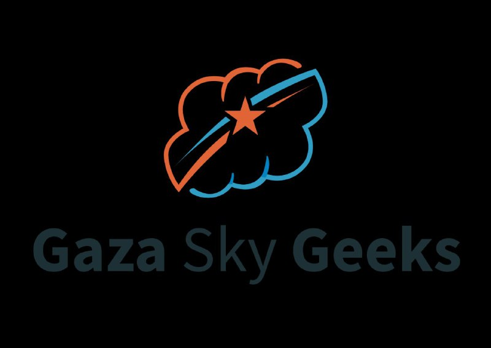

# 🧱 Python OOP – SkillStack Paths Training

This repository contains the Object-Oriented Programming (OOP) part of the training program  
SkillStack Paths (Fundamentals and Data Structures and Algorithms part)  
conducted by Gaza Sky Geeks.  
It includes practical exercises and mini-projects focused on OOP principles using Python.

---

## 📁 Folder Structure

All folders are located inside the GSG.OOP directory:

| Folder Name             | Description                                                                 |
|-------------------------|-----------------------------------------------------------------------------|
| Abstraction             | Demonstrates hiding implementation details and exposing essential features |
| Account                 | Simulates basic bank account operations using classes and methods          |
| Book                    | Models book objects with attributes and behaviors                          |
| ExceptionHandling       | Covers try-except blocks and error management                              |
| Inheritance             | Shows class inheritance and method overriding                              |
| Polymorphism            | Explains method overloading and dynamic behavior                           |
| RestorantManagement     | Mini project for managing restaurant orders and menu                       |
| Student                 | Represents student records and operations using OOP                        |
| VendingMachine          | Simulates a vending machine with item selection and balance tracking       |

---

## 🧠 Topics Covered

- Class creation and object instantiation
- Encapsulation and abstraction
- Inheritance and polymorphism
- Exception handling
- Real-world modeling using OOP
- Mini-projects applying OOP principles

---

## 👩‍💻 Author

Deema Mohammed AL-Maqadma  
Computer Science Student | GSG Trainee  
Focused on clean code, teamwork, and simplifying technical concepts.

---

## 📝 Notes

- All code is written in Python 3.
- Each folder contains focused examples or mini-projects.
- This repository represents the OOP phase of the training.  
  Other phases (Fundamentals, Data Structures) are available in separate repositories.

